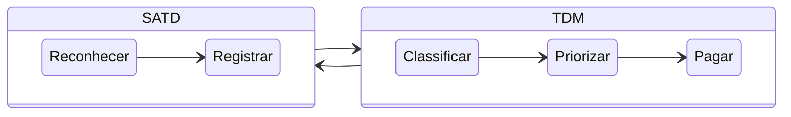

> [!important]\
> MSc. Yan Justino  
> Versão.: [1.0.0-beta]()  
> Data.: [03/2023]()  

# Technical Debt Ledger Framework (TDL)
A Dívida Técnica refere-se aos compromissos técnicos assumidos durante o desenvolvimento de software, quando uma solução rápida é escolhida em detrimento de uma abordagem mais sólida. Assim como uma dívida financeira, a Dívida Técnica precisa ser reconhecida e gerenciada para garantir a sustentabilidade e qualidade contínua do software.
O TDL é um framework dedicado ao gerenciamento eficaz de Dívida Técnica no desenvolvimento de software. Essa dívida, resultante de decisões rápidas em detrimento de soluções mais robustas. TDL se apoia em dois pilares principais:   

- ### ✅ Self-Admitted Technical Debt (SATD)
  - A equipe reconhece proativamente a existência de Dívida Técnica durante o desenvolvimento e a documenta para futuras ações corretivas.

- ### ✅ Technical Debt Management (TDM)
  - Uso de abordagem estruturada para gerenciar, monitorar e reduzir a Dívida Técnica ao longo do ciclo de vida do projeto.

> [!NOTE]\
> A Dívida Técnica refere-se aos compromissos técnicos assumidos durante o desenvolvimento de software, quando uma solução rápida é escolhida em detrimento de uma abordagem mais sólida. Assim como uma dívida financeira, a Dívida Técnica precisa ser reconhecida e gerenciada para garantir a sustentabilidade e qualidade contínua do software.

## Funcionalidades do Framework
TDL proporciona uma abordagem abrangente para lidar com a Dívida Técnica, promovendo a transparência, a responsabilidade e a qualidade contínua do software desenvolvido. é abordada por meio de seis funcionalidades-chave:

### 1. Reconhecer a Dívida

O TDL permite às equipes reconhecerem proativamente a presença de Dívida Técnica em seu código, identificando áreas que podem exigir atenção adicional.

### 2. Registrar a Dívida

Facilita o registro formal de todas as instâncias de Dívida Técnica, documentando detalhes importantes para um gerenciamento eficaz.

### 3. Classificar a Dívida

Permite a categorização da Dívida Técnica com base em critérios específicos, facilitando a compreensão das áreas de maior impacto e urgência.

### 4. Priorizar a Dívida

Ajuda na priorização das dívidas identificadas, considerando fatores como impacto no projeto, urgência e complexidade.

### 5. Qualificar a Dívida

Fornece ferramentas para avaliar a natureza da Dívida Técnica, permitindo uma compreensão mais profunda dos desafios envolvidos.

### 6. Pagar a Dívida

Facilita a criação de estratégias e planos para abordar e corrigir a Dívida Técnica, promovendo a saúde a longo prazo do software.

